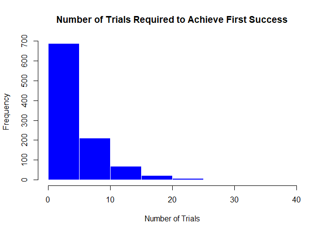

APM1110 - FA 6 - Dacanay
================

#### I. Geometric Distribution. Provide an R code for the geometric distribution. The geometric distribution is a probability distribution that models the number of trials required to achieve the first success in a sequence of Bernoulli trials, where each trial has a constant probability of success.

#### 1. Set the probability of success: p \<- 0.2

``` r
p <- 0.2
```

#### 2. Generate 1000 random variables from the geometric distribution.

``` r
x <- rgeom(1000, prob = p) + 1
```

#### 3. Calculate some basic statistics:

``` r
# Calculate some basic statistics
mean_x <- mean(x)
var_x <- var(x)
sd_x <- sd(x)
```

##### MEAN:

``` r
mean_x
```

    ## [1] 4.891

##### VARIANCE:

``` r
var_x
```

    ## [1] 20.18931

##### VARIANCE:

``` r
var_x
```

    ## [1] 20.18931

##### STANDARD DEVIATION:

``` r
sd_x
```

    ## [1] 4.493251

#### 4. Print the results in item 3 with the following output (string)

##### Number of trials required to achieve first success:

``` r
x
```

    ##    [1] 14  1  6  4  2  2  5  5  2  2  3  4 10  7  2  3  3  1  6  2 20  7  2  1
    ##   [25]  3  3  7  8  4  3  1  4  7  2  1  6  3  4  6  6  1  3 14  2  7  1  6 11
    ##   [49]  5 17 10 23  5 10  1  7  2  6  1 14  3  2  2  4  1  3  6  9  1 13  7  3
    ##   [73]  1  1  8  2  6  2  6  6  9  2  5  1  3  1 12  3  1  2  3  7  6  2  1  1
    ##   [97]  4  6  4 12  5  1 10 13  4  8  3  9  2  4  1  3  7  2  3  4 10  2  1  1
    ##  [121]  1  5 10  1  1 11  3  1 13  2  5  3  2  4  5  2  2 16  2  1  3  3  7  3
    ##  [145]  3 14  4  3  6  1  5  1  1  5  9  1 12  5  6  3  6 14  4  1  1  5  1  2
    ##  [169] 16  1  2  1  4  1  2  1  7  3  3  8  1  3  2  1  4 13  3  1  1  2  2 10
    ##  [193]  5  3  4  8  1  1  1  2  2  5 10  8  2  9  2  5  6  1  4  1  7  1  3  5
    ##  [217]  1  2  4  5  1  6  3  2  4  5 11  3  1  5  2  1  1  1 10  8 17  2  6  3
    ##  [241]  3  3  1  3  1  7  2  7  2  1  7  2  2 10  2  2  2  2  2  2  3  2  2  2
    ##  [265]  5  5  5  2  4  8  9  6  6  3  5  9  1  9  1  3 10  2  4  1  7  8  4  3
    ##  [289]  1  1 10 10  3  4 12  7 10 11  7  7  1  3  3 15 12  2  1  3  1  1  4  6
    ##  [313]  2  4  3  4  3  1  1  5  8  1  1  1  1  2 15  3 10  6  6 13  3  3  3  1
    ##  [337] 28  5  2  4  6  3  9  6  1  1  3  2 11  4  2  1  2  5 11  6  9  1  3  2
    ##  [361]  1 11 13  6  8  8  3  1  6  5  7  2  1  1  1  4  5  1  7  2  8  2  3  1
    ##  [385]  2  2  3  7  1  1  2  5  9  1  1  6  9  3  2  2  9  4 10  4  4  1  1  2
    ##  [409]  2  3 12  1 17  1  6  5 13  4  1  5  7  4  1  8  1  8  3  1  7  4 11  1
    ##  [433]  1 22 11  1  7  2  3 15  1  1  3  1  1  1 11 18 36  1  5  2  8  2  4  3
    ##  [457]  3  2  4  9  4  5  6  1  4  5  2  5  1  2  4  5 10  1 11  3  9  5  4  7
    ##  [481]  1  4  2  1  3  1 21  2  5  3  8  3  1  1  2  1  6  2 18  8  3  5  1  2
    ##  [505]  2 13  7 15 13  2  2  4  6  5  3  1  5 16  9  2  1  1  7  8  3 25  3  3
    ##  [529]  6  3  2  1  2  8  1  7  1  5  3  4  1  2  4  2  4  1 15  5 20 17  3 16
    ##  [553]  1  4  5  8  4  4  2  4  3  2  3  2  3  2  2  2  2  1  2 10  5  1 11 11
    ##  [577]  2  1  8 13  9  3  3 11  1  8 10  1 10  6  4  2 12  8  3  1  4  4  8  4
    ##  [601]  1  3 13 14  4  1  2  1  5  1  4  8  7  2  2  7  6 32  3  2  7  9  3  6
    ##  [625]  4  2  2  3  6  1  8 21  3  2 12  3  2  6  4 10  1  7  2  8  9  5  1  1
    ##  [649] 10  2  1 13  2  4 16 10  1  2  9  4  2  2  7 11  6  7  1 17 11  2 11  7
    ##  [673] 11  4  1 23  5 11  1  5  3  2  1  2  1  8 17  3 17  1  2  4  4  3  8  4
    ##  [697]  4  3  1 12  2  1  2 16  7 16  7 13  8  8  2  2  6 10  2  5  8  1  2  5
    ##  [721]  1  1  1  5  3  2  4  3  3  1  2  1  4  5  5  6 12  4  5  5  5  3  8  1
    ##  [745]  4  6  1  7  2  1  1  6  1  1 11  3  7  7  3  4  2  1  5  5  2  6  4  3
    ##  [769]  1  1  2  2  5  7  2  1  2  5 10  5  2 16  1  2  8  7  9  1  1  3 10  1
    ##  [793]  6  2  3  1  9 31  1  2  2 12  1  3  5  1 12  2  5 10  4  2 14  5  5  1
    ##  [817]  3 18  2  1  4  2  1  3  4  7  7  1  1  3  2  3  1  3  4 33  1  1  5  7
    ##  [841]  9 11  3  3  4  2  4  1  4 12  3 17  4  4  1  9  2  5  1  2  4 12  1  4
    ##  [865]  5 10  3  1  2  8  5  5 12  4  5  4  1  2  1  3  8  1  7  1  4  2  6  5
    ##  [889] 13  3  7  1  7  4  4  7  4  1 12  3  7  9  4  3  6  5  7  1  2  1  1  8
    ##  [913]  6 12  4 12  4  4  4 17  1  3  1  4  2  8  3  3  3  1  2  7  1  2  9  1
    ##  [937]  2  1  2 13  7  4  1  1 11  5  5  7  3  3  6  5  5  2  7  2  8  5  1  6
    ##  [961]  2  2  3 21  2  1  9  2  8  1  2  1  7 12  5 10  1  4  6  3  7  1  2  1
    ##  [985] 14  3  5 12  4  3  1  5  4  7  3  3  3  1  2  8

##### MEAN (in 2 decimal places):

``` r
mean_x_rounded <- round(mean_x, 2)
mean_x_rounded
```

    ## [1] 4.89

##### VARIANCE (in 2 decimal places):

``` r
var_x_rounded <- round(var_x, 2)
var_x_rounded
```

    ## [1] 20.19

##### STANDARD DEVIATION (in 2 decimal places):

``` r
sd_x_rounded <- round(sd_x, 2)
sd_x_rounded
```

    ## [1] 4.49

#### 5. Plot the histogram of the results.

``` r
hist(x, main = "Number of Trials Required to Achieve First Success",
     xlab = "Number of Trials", ylab = "Frequency",
     col = "blue", border = "white")
```

<!-- -->

#### II. Hypergeometric Distribution. Consider a plant manufacturing IC chips of which 10% are expected to be defective. The chips are packed in boxes for export. Before transportation, a sample is drawn from each box. Estimate the probability that the sample contains more than 10% defectives, when:

Assign values

``` r
# Population size
p_size_40 <- 40
p_size_5000 <- 5000

# Sample size
sample_size <- 10

# Defective Percentage
p_size_40_defective <- p_size_40 * 0.1
p_size_5000_defective <- p_size_5000 * 0.1

k <- 1
```

#### 1. A sample of 10 is selected from a box of 40

``` r
p_40 <- 1 - phyper(k, p_size_40_defective, p_size_40-p_size_40_defective, sample_size)
```

##### ANSWER:

``` r
p_40_rounded <- round(p_40, 4)
p_40_rounded
```

    ## [1] 0.2559

The probability that the sample contains more than 10% defectives when a
sample of 10 is selected from a box of 40 is $0.2559$ or $25.59$%.

#### 2. A sample of 10 is selected from a box of 5000.

``` r
p_5000 <- 1 - phyper(k, p_size_5000_defective, p_size_5000-p_size_5000_defective, sample_size)
```

##### ANSWER:

``` r
p_5000_rounded <- round(p_5000, 4)
p_5000_rounded
```

    ## [1] 0.2639

The probability that the sample contains more than 10% defectives when a
sample of 10 is selected from a box of 5000 is $0.2639$ or $26.39$%.
